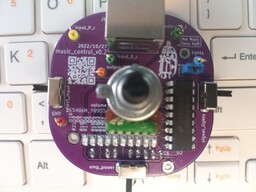

# Music amplifier:  
The amplifier on TDA7851L has two input sources, an additional subwoofer output and a control board for more convenient control.  
With remote controller via shielded Ethernet cable. The control device allows you to switch between two input sources, turn on / off the amplifier (standby-mode) and turn on / off the light music (two-channel mixer with a 1 kHz band-pass filter).

---
## Music amplifier:  
### Scheme:  
[pdf](music_amplifier/docs/music_amplifier_v3.2.pdf)  

### Gerber:  
Archive for production:  
[gerber_3.2](https://github.com/piro-s/music_amp_control/raw/main/music_amplifier/gerber/music_amplifier_v3.2.zip)  

---
## Music control:  
### View:  

### Scheme:  
[pdf](music_control/docs/music_control_v0.2.pdf)  

### Gerber:  
Archive for production:  
[gerber_0.2](https://github.com/piro-s/music_amp_control/raw/main/music_control/gerber/music_control_v0.2.zip)  